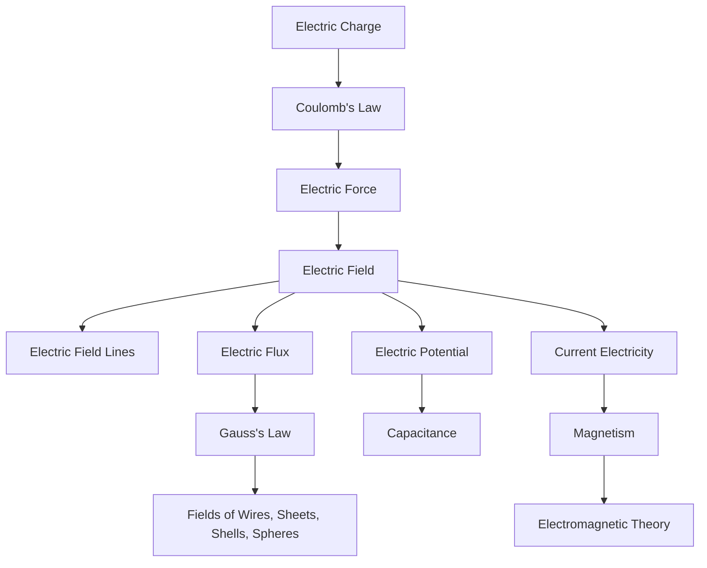

# Class 12 CBSE Physics Chapter 1: Electric Charges and Fields

> Level: CBSE Boards + JEE Main + JEE Advanced + Olympiad
> Subject: Physics
> Class: 12
> Board: CBSE
> Chapter: Electric Charges and Fields
> Part: 1
> Topics Covered: Chapter Overview, Historical Development, Electric Charge, Coulomb's Law, Electric Field Basics

---

## Prerequisites

Before starting this chapter, you should be comfortable with:

| Prerequisite        | Why It Matters                                            |
| ------------------- | --------------------------------------------------------- |
| Vectors             | Electric force and electric field are vector quantities   |
| Unit vectors        | Required for vector form of Coulomb's law                 |
| Basic algebra       | Needed for derivations and formula manipulation           |
| Trigonometry        | Needed for component resolution                           |
| Coordinate geometry | Needed for field due to multiple charges                  |
| Basic calculus      | Needed for continuous charge distributions                |
| Newton's laws       | Required to interpret electrostatic force and equilibrium |

---

## Learning Objectives

By the end of Part 1, you should be able to:

* Explain why electric charge is the starting point of electrostatics.
* Describe the historical development from static electricity to field theory.
* Explain conservation, quantisation, and additivity of charge.
* Distinguish conductors, insulators, and charge redistribution mechanisms.
* Apply Coulomb's law in scalar and vector forms.
* Use the superposition principle for multiple charges.
* Analyze equilibrium of charges qualitatively and mathematically.
* Define electric field as force per unit positive test charge.
* Derive electric field due to a point charge.
* Set up electric field integrals for continuous charge distributions.
* Recognize common CBSE, JEE, and Olympiad-level traps.

---

## Exam Relevance

| Exam         | What Matters Most                                                                             |
| ------------ | --------------------------------------------------------------------------------------------- |
| CBSE Boards  | Definitions, properties of charge, Coulomb's law, electric field derivations, diagrams, units |
| JEE Main     | Formula application, multi-charge systems, force-field relation, symmetry                     |
| JEE Advanced | Vector treatment, continuous charge distributions, limiting cases, equilibrium                |
| Olympiad     | Mechanism, field interpretation, scaling laws, conceptual paradoxes, symmetry arguments       |

---

## Estimated Study Time

| Level                      | Time Required  |
| -------------------------- | -------------- |
| CBSE basic reading         | 3 to 4 hours   |
| CBSE derivation mastery    | 5 to 6 hours   |
| JEE Main problem readiness | 8 to 10 hours  |
| JEE Advanced readiness     | 15 to 20 hours |
| Olympiad conceptual depth  | 25+ hours      |

---

## Table of Contents

1. [Chapter Overview](#1-chapter-overview)
2. [Historical and Conceptual Development](#2-historical-and-conceptual-development)
3. [Electric Charge](#3-electric-charge)
4. [Coulomb's Law](#4-coulombs-law)
5. [Electric Field Basics](#5-electric-field-basics)
6. [Part 1 Summary](#part-1-summary)
7. [Part 1 Checklist](#part-1-checklist)

---

# 1. Chapter Overview

## 1.1 What This Chapter Is About

This chapter begins the study of **electrostatics**, the branch of physics dealing with electric charges at rest.

The fundamental chain of ideas is:

```text
Electric charge
    ↓
Electrostatic force
    ↓
Coulomb's law
    ↓
Electric field
    ↓
Electric field lines
    ↓
Electric flux
    ↓
Gauss's law
    ↓
Applications to symmetric charge distributions
```

Part 1 covers the first major foundation:

```text
Charge → Coulomb force → Electric field
```

The later parts of the chapter build on this foundation to study field lines, dipoles, flux, and Gauss's law.

---

## 1.2 Why Electrostatics Begins with Electric Charge

Electric charge is the source of electric interaction.

A body experiences electrostatic force because it has charge. Without charge, there is no electrostatic interaction.

A useful analogy is:

| Theory         | Source Quantity | Field Produced      | Force Experienced By |
| -------------- | --------------- | ------------------- | -------------------- |
| Gravitation    | Mass            | Gravitational field | Mass                 |
| Electrostatics | Electric charge | Electric field      | Electric charge      |

However, electric charge is more subtle than mass.

| Property     | Mass                     | Electric Charge                   |
| ------------ | ------------------------ | --------------------------------- |
| Sign         | Always positive          | Positive or negative              |
| Interaction  | Only attractive          | Attractive or repulsive           |
| Shielding    | Not practically possible | Possible using conductors         |
| Strength     | Weak                     | Very strong compared to gravity   |
| Cancellation | Rare                     | Common because charges can cancel |

This is why the study of electricity starts with the nature and behavior of charge.

---

## 1.3 Central Ideas of the Chapter

The complete chapter is built around five central quantities.

| Quantity        | Meaning                                             | Role                                   |
| --------------- | --------------------------------------------------- | -------------------------------------- |
| Electric charge | Fundamental property causing electric interaction   | Source of electric field               |
| Electric force  | Interaction between charges                         | Described by Coulomb's law             |
| Electric field  | Force per unit positive charge                      | Describes influence of charge in space |
| Electric flux   | Measure of electric field passing through a surface | Leads to Gauss's law                   |
| Gauss's law     | Relation between flux and enclosed charge           | Powerful for symmetric systems         |

The logical development is:



---

## 1.4 Connection to Later Chapters

### 1.4.1 Connection to Electric Potential

Electric field describes force.

Electric potential describes energy.

If a charge $q$ is placed in an electric field $\vec{E}$, it experiences force:

$$
\vec{F} = q\vec{E}
$$

Later, electric potential $V$ is defined as potential energy per unit charge:

$$
V = \frac{U}{q}
$$

Electric field and potential are connected by:

$$
\vec{E} = -\nabla V
$$

In one dimension:

$$
E = -\frac{dV}{dx}
$$

So this chapter gives the **force-field picture**, while the next topic gives the **energy-potential picture**.

---

### 1.4.2 Connection to Capacitance

A capacitor stores separated charges.

To understand capacitance, you need:

* charge separation,
* electric field between plates,
* potential difference,
* energy stored in electric field.

For a parallel-plate capacitor, the electric field between plates is:

$$
E = \frac{\sigma}{\epsilon_0}
$$

This result comes from Gauss's law, which belongs to this chapter.

---

### 1.4.3 Connection to Current Electricity

Current electricity studies moving charges.

The motion of charge is caused by electric force:

$$
\vec{F} = q\vec{E}
$$

In a conductor, free electrons drift because an electric field acts on them.

Thus:

```text
Electric field → Force on electrons → Drift velocity → Electric current
```

Without understanding electric field, current electricity becomes formula memorization.

---

### 1.4.4 Connection to Magnetism

Electrostatics studies charges at rest.

Magnetism studies effects associated with moving charges.

```text
Charge at rest → Electric field
Charge in motion → Magnetic field
```

Thus magnetism is not separate from electricity. It is a deeper extension of charge dynamics.

---

### 1.4.5 Connection to Electromagnetic Induction

A changing magnetic field creates an electric field.

This is Faraday's law:

$$
\oint \vec{E} \cdot d\vec{l} = -\frac{d\Phi_B}{dt}
$$

Electrostatics first teaches electric field due to charges. Electromagnetic induction later teaches electric field due to changing magnetic fields.

---

### 1.4.6 Connection to Electromagnetic Waves

Maxwell showed that changing electric and magnetic fields sustain each other and propagate as waves.

Light itself is an electromagnetic wave.

This chapter begins that journey by introducing the electric field.

---

## 1.5 CBSE Board Focus

For CBSE, the important expectations are:

| Topic                          | Importance | What to Master                |
| ------------------------------ | ---------- | ----------------------------- |
| Electric charge                | High       | Definition, types, properties |
| Conservation of charge         | High       | Statement and examples        |
| Quantisation of charge         | High       | $q = ne$                      |
| Conductors and insulators      | Medium     | Conceptual explanation        |
| Coulomb's law                  | Very high  | Statement, formula, units     |
| Vector form of Coulomb's law   | High       | Direction and sign            |
| Superposition principle        | High       | Force due to multiple charges |
| Electric field                 | Very high  | Definition and derivation     |
| Field due to point charge      | Very high  | Board derivation              |
| Continuous charge distribution | Medium     | Basic density definitions     |

CBSE typically rewards:

* correct definitions,
* clear diagrams,
* stepwise derivations,
* correct units,
* correct final formula,
* proper explanation of symbols.

---

## 1.6 JEE Advanced and Olympiad Focus

For JEE Advanced and Olympiad-level preparation, the focus shifts from memorization to construction.

You must be able to derive results from first principles.

| Topic               | Advanced Requirement                           |
| ------------------- | ---------------------------------------------- |
| Coulomb's law       | Use vector form fluently                       |
| Superposition       | Add fields and forces component-wise           |
| Equilibrium         | Analyze stability, not just zero force         |
| Continuous charge   | Convert sums into integrals                    |
| Symmetry            | Predict field directions before integrating    |
| Conductors          | Understand charge redistribution and shielding |
| Inverse-square laws | Connect to geometry of 3D space                |
| Field concept       | Understand local interaction mechanism         |

A JEE/Olympiad student should ask:

```text
Why does this formula have this form?
What symmetry decides the direction?
What happens in the limiting case?
What changes if the distribution is not point-like?
What physical mechanism causes the result?
```

---

# 2. Historical and Conceptual Development

## 2.1 Why History Matters in Electrostatics

The ideas in electrostatics were not invented as isolated formulas. Each concept was introduced to solve a physical problem.

| Historical Stage                | Physical Problem                                             |
| ------------------------------- | ------------------------------------------------------------ |
| Static electricity observations | Why do rubbed objects attract light objects?                 |
| Charge concept                  | What property causes attraction and repulsion?               |
| Two kinds of charge             | Why do some charged bodies attract while others repel?       |
| Coulomb's law                   | How does electric force depend on charge and distance?       |
| Electric field                  | How does one charge influence another through space?         |
| Field lines                     | How can invisible fields be visualized?                      |
| Gauss's law                     | How can field be calculated using symmetry?                  |
| Maxwell theory                  | How do electric and magnetic fields form one unified theory? |

---

## 2.2 Early Observations of Static Electricity

Ancient observers noticed that amber rubbed with fur could attract light objects.

Examples:

```text
Amber rubbed with fur attracts straw.
A plastic comb rubbed through dry hair attracts paper bits.
A glass rod rubbed with silk attracts small objects.
```

The word "electricity" comes from the Greek word for amber, "elektron".

The initial problem was:

```text
Why does rubbing an object allow it to attract other objects?
```

At this stage, there was no concept of charge. The phenomenon looked like a mysterious attractive ability created by rubbing.

---

## 2.3 Why the Concept of Electric Charge Was Introduced

Scientists needed a physical property that could explain:

* attraction,
* repulsion,
* transfer of electrical behavior,
* neutralization,
* strengthening or weakening of electrical effects.

The concept of **electric charge** was introduced as that property.

A charged body is a body that has an imbalance of positive and negative charge.

A neutral body has equal total positive and negative charge.

```text
Neutral body:
positive charge = negative charge

Positively charged body:
positive charge > negative charge

Negatively charged body:
negative charge > positive charge
```

---

## 2.4 Positive and Negative Charge

Benjamin Franklin introduced the terms positive and negative charge.

The convention is:

* glass rubbed with silk becomes positively charged,
* ebonite or plastic rubbed with fur becomes negatively charged.

Modern atomic interpretation:

| Body Becomes       | Microscopic Meaning     |
| ------------------ | ----------------------- |
| Positively charged | It has lost electrons   |
| Negatively charged | It has gained electrons |

Important:

Positive charge does not usually move in solids during ordinary charging. Electrons move.

---

## 2.5 Coulomb's Torsion Balance Experiment

Charles-Augustin de Coulomb measured the force between charged objects using a torsion balance.

The problem he solved was:

```text
How does electrostatic force depend quantitatively on charge and distance?
```

### Basic Setup

```text
             Thin torsion fiber
                    |
                    |
              Charged sphere B
                    o
                    |
                    |
Charged sphere A o       repulsion twists the fiber
```

A charged sphere repelled another charged sphere attached to a thin fiber. The fiber twisted. The angle of twist gave a measure of force.

Coulomb found two major dependences:

$$
F \propto q_1q_2
$$

and

$$
F \propto \frac{1}{r^2}
$$

Combining:

$$
F \propto \frac{q_1q_2}{r^2}
$$

This became Coulomb's law.

---

## 2.6 Why Action-at-a-Distance Was Conceptually Incomplete

Coulomb's law gives the correct force between two point charges.

But it raises a deeper question:

```text
How does one charge know that another charge is present far away?
```

A direct force across empty space is called **action at a distance**.

This view gives a formula but not a mechanism.

The conceptual problem is especially serious when charges move or fields change. If one charge changes position, does the other charge feel the change instantly? Modern physics says no. Electromagnetic influence propagates at finite speed.

This motivated the field concept.

---

## 2.7 Faraday and the Electric Field Concept

Michael Faraday introduced the idea that a charge modifies the space around it.

Instead of saying:

```text
Charge q1 directly pulls or pushes charge q2.
```

field theory says:

```text
Charge q1 creates an electric field in surrounding space.
Charge q2 interacts with the electric field at its own location.
```

Thus the electric field is a local mediator of interaction.

The force on charge $q$ placed in electric field $\vec{E}$ is:

$$
\vec{F} = q\vec{E}
$$

This is a much deeper statement than Coulomb's law alone.

---

## 2.8 Faraday's Field-Line Model

Faraday visualized electric fields using lines of force.

For a positive point charge:

```text
        ↑
     ↖  |  ↗
       \|/
←-------+-------→
       /|\
     ↙  |  ↘
        ↓
```

For a negative point charge:

```text
        ↓
     ↘  |  ↙
       /|\
→-------−-------←
       \|/
     ↗  |  ↖
        ↑
```

Field lines represent:

* direction of electric field,
* relative strength of electric field,
* symmetry of the charge configuration.

The field-line model solved the visualization problem:

```text
How can an invisible field be represented geometrically?
```

---

## 2.9 Gauss and Symmetry-Based Understanding

Coulomb's law works well for point charges but becomes difficult for extended charge distributions.

For example, finding the field of a charged spherical shell by direct integration is possible but lengthy.

Gauss's law gives a more powerful relation:

\frac{q_{\text{enclosed}}}{\epsilon_0}
$$

This means:

```text
Net electric flux through a closed surface depends only on the net enclosed charge.
```

Gauss's law solved the problem:

```text
How can electric fields be calculated efficiently for highly symmetric charge distributions?
```

---

## 2.10 Connection to Maxwell's Electromagnetic Theory

Maxwell unified electricity and magnetism.

One of Maxwell's equations is the differential form of Gauss's law:

$$
\nabla \cdot \vec{E} = \frac{\rho}{\epsilon_0}
$$

This says:

```text
Electric charges are sources or sinks of electric field.
```

Positive charge acts as a source of electric field.

Negative charge acts as a sink of electric field.

Thus this chapter is the first step toward the full Maxwellian view of electromagnetism.

---

## 2.11 Historical Ideas Table

| Historical Idea               | Problem It Solved                                | New Concept Created                | Why It Was Important                                 |
| ----------------------------- | ------------------------------------------------ | ---------------------------------- | ---------------------------------------------------- |
| Static electricity by rubbing | Why rubbed bodies attract light objects          | Electrification                    | Started study of electrical phenomena                |
| Charge                        | What property causes attraction and repulsion    | Electric charge                    | Gave measurable source of electric interaction       |
| Positive and negative charge  | Why some charged bodies attract and others repel | Two types of charge                | Explained attraction, repulsion, and neutralization  |
| Coulomb's torsion balance     | How force depends on distance and charge         | Coulomb's law                      | Made electrostatics quantitative                     |
| Electric field                | How charges interact through space               | Field theory                       | Replaced action-at-a-distance with local interaction |
| Field lines                   | How to visualize invisible fields                | Lines of force                     | Helped represent direction and strength              |
| Gauss's law                   | How to exploit symmetry                          | Electric flux and Gaussian surface | Simplified field calculations                        |
| Maxwell's theory              | How electricity and magnetism connect            | Electromagnetic field              | Unified optics, electricity, and magnetism           |

---

# 3. Electric Charge

## 3.1 Meaning of Electric Charge

Electric charge is a fundamental physical property of matter due to which bodies experience electric forces.

A charged body can attract or repel another charged body.

There are two types of charge:

```text
Positive charge
Negative charge
```

Like charges repel.

Unlike charges attract.

```text
+ and + repel
- and - repel
+ and - attract
```

---

## 3.2 SI Unit of Charge

The SI unit of charge is the **coulomb**, written as $C$.

The charge of an electron is:

$$
q_e = -1.602 \times 10^{-19} , C
$$

The charge of a proton is:

$$
q_p = +1.602 \times 10^{-19} , C
$$

The magnitude of the elementary charge is:

$$
e = 1.602 \times 10^{-19} , C
$$

---

## 3.3 Charge as a Physical Property

Charge is not a material substance. It is a property of particles.

| Particle | Charge |
| -------- | ------ |
| Electron | $-e$   |
| Proton   | $+e$   |
| Neutron  | $0$    |

An object becomes charged due to imbalance between positive and negative charges.

A neutral atom has:

$$
\text{number of protons} = \text{number of electrons}
$$

If electrons are removed, the body becomes positive.

If electrons are added, the body becomes negative.

---

## 3.4 What Actually Moves During Charging

In ordinary solids, electrons move more easily than protons.

Reason:

* protons are inside nuclei,
* nuclei are locked in the atomic lattice,
* outer electrons can be transferred or redistributed.

Therefore:

```text
Positive charging usually means loss of electrons.
Negative charging usually means gain of electrons.
```

This is a key CBSE and JEE conceptual point.

---

## 3.5 Conservation of Charge

### Statement

The total electric charge of an isolated system remains constant.

Charge can neither be created nor destroyed. It can only be transferred from one body to another.

Mathematically:

$$
q_{\text{initial}} = q_{\text{final}}
$$

---

### Example

Suppose two neutral bodies are rubbed together.

Initially:

$$
q_{\text{total}} = 0
$$

After rubbing, one body gets charge $+Q$ and the other gets charge $-Q$.

Final total charge:

$$
q_{\text{total}} = +Q + (-Q) = 0
$$

Thus charge is conserved.

---

### CBSE Explanation

When two bodies are rubbed, electrons are transferred from one body to the other. One body becomes positively charged and the other becomes negatively charged. The total charge of the two-body system remains unchanged.

---

### Deeper Mechanism

Charge conservation is a fundamental law of nature.

At the microscopic level, when electrons transfer:

```text
Body A loses n electrons → charge becomes +ne
Body B gains n electrons → charge becomes -ne
```

Total charge:

$$
+ne - ne = 0
$$

So charging is not creation of charge. It is separation or transfer of charge.

---

### Real-World Example

When a plastic comb is rubbed through dry hair:

* electrons transfer between hair and comb,
* comb may become negatively charged,
* hair becomes positively charged,
* total charge remains conserved.

---

### Common Misconception

| Misconception                                     | Correct Concept                                        |
| ------------------------------------------------- | ------------------------------------------------------ |
| Rubbing creates charge                            | Rubbing transfers charge                               |
| A charged body has only one type of charge        | It has imbalance between positive and negative charges |
| Positive charge is added during positive charging | Usually electrons are removed                          |

---

### JEE-Level Trap

If multiple conductors touch and separate, total charge is conserved, but charge may not divide equally.

Equal division occurs only for identical conductors in symmetric surroundings.

---

## 3.6 Quantisation of Charge

### Statement

Electric charge exists in discrete packets.

Any charge $q$ on a body is an integral multiple of elementary charge $e$.

$$
q = ne
$$

where:

$$
n = 0, \pm 1, \pm 2, \pm 3, \ldots
$$

and:

$$
e = 1.602 \times 10^{-19} , C
$$

---

### CBSE Explanation

Since charge transfer occurs by transfer of electrons, and each electron has charge $e$, the total charge transferred must be an integral multiple of $e$.

---

### Deeper Mechanism

You cannot transfer half an electron in ordinary electrostatics.

If a body gains $n$ electrons:

$$
q = -ne
$$

If a body loses $n$ electrons:

$$
q = +ne
$$

---

### Why Macroscopic Charge Appears Continuous

The value of $e$ is extremely small.

Number of electrons in one coulomb of charge:

$$
n = \frac{1}{e}
$$

$$
n = \frac{1}{1.602 \times 10^{-19}}
$$

$$
n \approx 6.24 \times 10^{18}
$$

So even a small macroscopic charge contains an enormous number of electrons.

Therefore charge appears continuous in ordinary measurements.

---

### Real-World Example

A charge of $1 , \mu C$ corresponds to:

$$
n = \frac{10^{-6}}{1.602 \times 10^{-19}}
$$

$$
n \approx 6.24 \times 10^{12}
$$

That means $1 , \mu C$ corresponds to trillions of electrons.

---

### Common Misconception

| Misconception                                   | Correct Concept                            |
| ----------------------------------------------- | ------------------------------------------ |
| Any amount of charge is possible                | Charge must be an integral multiple of $e$ |
| Quantisation matters in every numerical problem | It matters mainly at microscopic scale     |
| $0.5e$ charge can exist on a normal body        | Not in ordinary electrostatics             |

---

### JEE-Level Trap

If a problem asks whether a charge is physically possible, check whether:

$$
\frac{q}{e}
$$

is an integer.

Example:

$$
q = 3.204 \times 10^{-19} C
$$

Since:

$$
\frac{q}{e} \approx 2
$$

this is possible.

But:

$$
q = 2.5 \times 10^{-19} C
$$

is not possible as a charge on an isolated body in ordinary electrostatics.

---

## 3.7 Additivity of Charge

### Statement

The total charge of a system is the algebraic sum of all individual charges.

$$
Q_{\text{total}} = q_1 + q_2 + q_3 + \cdots
$$

Charge is a scalar quantity, but it can be positive or negative.

---

### Example

If:

$$
q_1 = +3 , \mu C
$$

$$
q_2 = -5 , \mu C
$$

$$
q_3 = +2 , \mu C
$$

Then:

$$
Q_{\text{total}} = 3 - 5 + 2 = 0
$$

The system is neutral.

---

### CBSE Explanation

Charges add algebraically because positive and negative signs represent opposite types of charge.

---

### Deeper Mechanism

Charge has no spatial direction. Therefore, it is not a vector.

The sign of charge is not a direction in space.

This is different from electric field and electric force, which are vectors.

---

### JEE-Level Trap

A system may have zero net charge but non-zero electric field.

Example:

An electric dipole has charges $+q$ and $-q$.

Net charge:

$$
Q_{\text{net}} = +q - q = 0
$$

But the dipole produces a non-zero electric field around it.

Therefore:

```text
Zero net charge does not imply zero electric field everywhere.
```

---

## 3.8 Conductors

A conductor is a material in which electric charges can move freely.

Examples:

* copper,
* aluminium,
* silver,
* graphite,
* salt solution,
* human body,
* Earth.

In metals, free electrons are responsible for conduction.

---

### CBSE Explanation

Conductors allow electric charge to flow through them because they contain free electrons.

---

### Deeper Mechanism

In a metal, outer electrons are not strongly bound to individual atoms. They form a mobile electron cloud.

If an electric field is applied, these electrons experience force:

$$
\vec{F} = q\vec{E}
$$

For an electron:

$$
q = -e
$$

So the force on an electron is opposite to the electric field.

---

### Real-World Example

A metal rod touched to a charged object can quickly spread charge along its surface.

---

### Common Misconception

| Misconception                                  | Correct Concept                                |
| ---------------------------------------------- | ---------------------------------------------- |
| Conductors create charge                       | Conductors allow charge movement               |
| All conductors are metals                      | Salt solutions and human body can also conduct |
| Electric field inside conductor is always zero | It is zero only in electrostatic equilibrium   |

---

### JEE-Level Trap

In electrostatics:

$$
\vec{E}_{\text{inside conductor}} = 0
$$

But in current electricity, a wire carrying steady current has a non-zero internal electric field that drives electron drift.

---

## 3.9 Insulators

An insulator is a material in which charges cannot move freely.

Examples:

* rubber,
* glass,
* plastic,
* dry wood,
* mica,
* air under normal conditions.

---

### CBSE Explanation

Insulators do not allow charge to flow easily because they do not have free charge carriers.

---

### Deeper Mechanism

In insulators, electrons are strongly bound to atoms or molecules.

They cannot move freely through the material.

However, charges inside atoms or molecules may shift slightly under an external electric field. This is called polarization.

---

### Real-World Example

A plastic comb can hold charge after being rubbed because charge does not easily leak away.

---

### Common Misconception

| Misconception                                | Correct Concept                                         |
| -------------------------------------------- | ------------------------------------------------------- |
| Insulators cannot be charged                 | Insulators can be charged, but charge remains localized |
| No charge exists in insulators               | Charges exist but are not free to move                  |
| Insulators are unaffected by electric fields | They can polarize in electric fields                    |

---

### JEE-Level Trap

An insulator can have non-zero electric field inside it in electrostatic equilibrium.

The condition $\vec{E} = 0$ inside applies to conductors, not general insulators.

---

## 3.10 Charging by Friction

Charging by friction occurs when two different materials are rubbed together and electrons transfer from one to the other.

Example:

```text
Glass rod rubbed with silk:

Glass loses electrons → glass becomes positive
Silk gains electrons → silk becomes negative
```

Another example:

```text
Plastic rod rubbed with fur:

Plastic gains electrons → plastic becomes negative
Fur loses electrons → fur becomes positive
```

---

### Mechanism

Rubbing increases surface contact and separation between two materials.

Different materials hold electrons with different strengths. Electrons transfer from the material that holds them weakly to the material that holds them strongly.

---

### Real-World Example

A balloon rubbed on hair sticks to a wall due to electrostatic attraction.

---

### Common Misconception

| Misconception                           | Correct Concept                       |
| --------------------------------------- | ------------------------------------- |
| Friction creates charge                 | Friction transfers charge             |
| Both bodies get the same type of charge | They get equal and opposite charges   |
| Only one body becomes charged           | Both bodies become charged oppositely |

---

### JEE-Level Trap

Humidity reduces static charging because water molecules in air provide a conducting path for charge leakage.

---

## 3.11 Charging by Conduction

Charging by conduction occurs when a charged body touches a neutral conductor.

Example:

```text
Negatively charged rod touches neutral metal sphere.
Electrons move from rod to sphere.
Sphere becomes negatively charged.
```

---

### Diagram

```text
Before contact:

Rod:      - - - - -
Sphere:   neutral

After contact:

Rod:      - -
Sphere:   - - -
```

---

### CBSE Explanation

In conduction, charge is transferred by direct contact. The neutral body usually gets the same type of charge as the charged body.

---

### Deeper Mechanism

When two conductors touch, they form a single conducting system.

Charges move until both conductors reach the same electric potential.

For conductors in electrostatic equilibrium:

$$
V_1 = V_2
$$

If the conductors are identical spheres, the charge divides equally.

If they are not identical, charge division depends on size, shape, and surroundings.

---

### Real-World Example

Touching a charged metal sphere with another neutral metal sphere transfers charge to the neutral sphere.

---

### Common Misconception

| Misconception                        | Correct Concept                                                             |
| ------------------------------------ | --------------------------------------------------------------------------- |
| Charge always divides equally        | Equal division only for identical conductors in symmetric conditions        |
| Conduction can occur without contact | Direct electrical contact is required                                       |
| Only negative charge can transfer    | In solids, electrons move, but positive charging can occur by electron loss |

---

### JEE-Level Trap

For two isolated conducting spheres far apart, connected by a wire:

$$
V_1 = V_2
$$

For a spherical conductor:

$$
V = \frac{kQ}{R}
$$

Therefore:

$$
\frac{kQ_1}{R_1} = \frac{kQ_2}{R_2}
$$

So:

$$
\frac{Q_1}{Q_2} = \frac{R_1}{R_2}
$$

The larger sphere gets more charge.

---

## 3.12 Charging by Induction

Charging by induction charges a conductor without direct contact with the charged body.

Consider a negatively charged rod brought near a neutral metal sphere.

### Step 1: Charge Separation

```text
Negative rod          Neutral conducting sphere

- - - - -             + + + | - - -
                      near    far
```

The negative rod repels electrons in the sphere to the far side.

The near side becomes positive due to electron deficiency.

The sphere is still neutral overall.

---

### Step 2: Ground the Sphere

```text
Negative rod          Sphere connected to Earth

- - - - -             + + + | electrons flow to Earth
```

Electrons flow from the sphere into Earth.

---

### Step 3: Remove Ground Connection

The sphere is now electron-deficient.

It has net positive charge.

---

### Step 4: Remove the Rod

The positive charge redistributes on the sphere.

```text
Final sphere: positively charged
```

---

### Important Order

For induction:

```text
1. Bring charged body near conductor.
2. Connect conductor to Earth.
3. Remove Earth connection.
4. Remove charged body.
```

If the charged body is removed before grounding is disconnected, separated charges may recombine.

---

### CBSE Explanation

In induction, a charged body causes redistribution of charges in a nearby conductor. With grounding, one type of charge flows to or from Earth, leaving the conductor with net charge opposite to the inducing body.

---

### Deeper Mechanism

The external charged body creates an electric field inside the conductor.

Free electrons move in response until electrostatic equilibrium is reached.

Grounding allows charge exchange with Earth.

Earth acts as a large charge reservoir.

---

### Real-World Example

Lightning can induce charges on objects on Earth before an actual discharge occurs.

---

### Common Misconception

| Misconception                    | Correct Concept                                     |
| -------------------------------- | --------------------------------------------------- |
| Induction requires contact       | Induction occurs without contact                    |
| The inducing body loses charge   | Ideally, the inducing body need not lose charge     |
| Induced charge is always uniform | Distribution depends on geometry and external field |

---

### JEE-Level Trap

A grounded conductor near an external charge can have non-zero induced charge even though its potential is zero.

```text
Zero potential does not imply zero charge.
```

---

## 3.13 Earthing or Grounding

Earthing means connecting a charged body to Earth through a conductor.

Earth can supply or absorb a large amount of charge without significant change in its potential.

By convention:

$$
V_{\text{Earth}} = 0
$$

---

### Positive Body Connected to Earth

A positively charged body attracts electrons from Earth.

```text
Earth → electrons → positive body
```

The body becomes neutral.

---

### Negative Body Connected to Earth

A negatively charged body sends excess electrons to Earth.

```text
negative body → electrons → Earth
```

The body becomes neutral.

---

### Grounding in Induction

Grounding is used to remove or supply electrons while charges are separated by an external charged body.

---

### Common Misconception

| Misconception                                       | Correct Concept                                                       |
| --------------------------------------------------- | --------------------------------------------------------------------- |
| Grounding always makes charge zero                  | In external fields, grounded conductors can still have induced charge |
| Earth has infinite charge                           | Earth is treated as a very large reservoir                            |
| Zero potential means zero electric field everywhere | Potential and field are different quantities                          |

---

## 3.14 Charge Redistribution on Conductors

If excess charge is placed on a conductor, charges move until electrostatic equilibrium is reached.

At electrostatic equilibrium:

* electric field inside the conductor is zero,
* excess charge lies on the outer surface,
* conductor is an equipotential,
* electric field just outside the surface is normal to the surface,
* charge density is greater near sharp points.

---

### Why Electric Field Inside a Conductor Is Zero

If an electric field existed inside a conductor, free electrons would experience force:

$$
\vec{F} = q\vec{E}
$$

They would move.

But electrostatic equilibrium means charges are at rest.

Therefore:

$$
\vec{E}_{\text{inside conductor}} = 0
$$

---

### Why Excess Charge Resides on the Surface

If excess charge remained inside the bulk of a conductor, it would create an internal electric field.

That field would move free charges.

Since equilibrium requires no internal field, excess charge must move to the surface.

---

### Why Charge Density Is Larger at Sharp Points

At sharp points, the radius of curvature is small.

Charges crowd more strongly there, producing large surface charge density.

Large surface charge density produces large electric field near the surface.

This explains:

* lightning rods are pointed,
* corona discharge occurs near sharp conductors,
* charge leakage is easier from sharp points.

---

# 4. Coulomb's Law

## 4.1 Statement of Coulomb's Law

Coulomb's law states:

The electrostatic force between two stationary point charges is directly proportional to the product of the magnitudes of the charges and inversely proportional to the square of the distance between them. The force acts along the line joining the two charges.

Scalar form:

$$
F = \frac{1}{4\pi\epsilon_0}\frac{|q_1q_2|}{r^2}
$$

where:

| Symbol                     | Meaning                          |
| -------------------------- | -------------------------------- |
| $F$                        | Magnitude of electrostatic force |
| $q_1, q_2$                 | Point charges                    |
| $r$                        | Separation between charges       |
| $\epsilon_0$               | Permittivity of free space       |
| $\frac{1}{4\pi\epsilon_0}$ | Coulomb constant                 |

Coulomb constant:

$$
k = \frac{1}{4\pi\epsilon_0}
$$

$$
k \approx 9 \times 10^9 , N,m^2C^{-2}
$$

Permittivity of free space:

$$
\epsilon_0 = 8.854 \times 10^{-12} , C^2N^{-1}m^{-2}
$$

---

## 4.2 Nature of the Force

The electrostatic force is:

* attractive for unlike charges,
* repulsive for like charges,
* central,
* along the line joining the charges,
* equal and opposite on the two charges.

For like charges:

```text
+q1          +q2

q1 ←-------- --------→ q2
       repulsion
```

For unlike charges:

```text
+q1          -q2

q1 --------→ ←-------- q2
       attraction
```

---

## 4.3 CBSE Board-Style Derivation of Coulomb's Law

### Given

Two point charges $q_1$ and $q_2$ are separated by distance $r$ in vacuum.

### Experimental Observations

Coulomb found:

$$
F \propto |q_1q_2|
$$

and:

$$
F \propto \frac{1}{r^2}
$$

Combining:

$$
F \propto \frac{|q_1q_2|}{r^2}
$$

Introducing proportionality constant $k$:

$$
F = k\frac{|q_1q_2|}{r^2}
$$

In SI units:

$$
k = \frac{1}{4\pi\epsilon_0}
$$

Therefore:

$$
F = \frac{1}{4\pi\epsilon_0}\frac{|q_1q_2|}{r^2}
$$

The force is along the line joining the charges. It is repulsive for like charges and attractive for unlike charges.

---

## 4.4 Vector Form of Coulomb's Law

The scalar form gives magnitude only.

The vector form gives both magnitude and direction.

Suppose charge $q_1$ is at position $\vec{r}_1$ and charge $q_2$ is at position $\vec{r}_2$.

Define:

$$
\vec{r}_{21} = \vec{r}_2 - \vec{r}_1
$$

This vector points from $q_1$ to $q_2$.

The force on $q_2$ due to $q_1$ is:

\frac{1}{4\pi\epsilon_0}
\frac{q_1q_2}{|\vec{r}*{21}|^3}*
*\vec{r}*{21}
$$

Equivalently:

\frac{1}{4\pi\epsilon_0}
\frac{q_1q_2}{r_{21}^2}
\hat{r}_{21}
$$

where $\hat{r}_{21}$ is the unit vector from $q_1$ to $q_2$.

---

## 4.5 Direction from Vector Form

The sign of $q_1q_2$ automatically decides attraction or repulsion.

### Like Charges

If both charges have the same sign:

$$
q_1q_2 > 0
$$

Then $\vec{F}*{21}$ is along $\hat{r}*{21}$.

So $q_2$ is pushed away from $q_1$.

This is repulsion.

### Unlike Charges

If charges have opposite signs:

$$
q_1q_2 < 0
$$

Then $\vec{F}*{21}$ is opposite to $\hat{r}*{21}$.

So $q_2$ is pulled toward $q_1$.

This is attraction.

---

## 4.6 Newton's Third Law in Coulomb's Law

The force on $q_2$ due to $q_1$ and the force on $q_1$ due to $q_2$ are equal and opposite.

$$
\vec{F}*{12} = -\vec{F}*{21}
$$

This is consistent with Newton's third law.

---

## 4.7 Role of Permittivity

In vacuum:

$$
F = \frac{1}{4\pi\epsilon_0}\frac{|q_1q_2|}{r^2}
$$

In a medium:

$$
F = \frac{1}{4\pi\epsilon}\frac{|q_1q_2|}{r^2}
$$

where $\epsilon$ is the permittivity of the medium.

Relative permittivity or dielectric constant:

$$
K = \frac{\epsilon}{\epsilon_0}
$$

Therefore:

$$
\epsilon = K\epsilon_0
$$

So:

\frac{1}{4\pi K\epsilon_0}
\frac{|q_1q_2|}{r^2}
$$

Hence:

$$
F_{\text{medium}} = \frac{F_{\text{vacuum}}}{K}
$$

---

## 4.8 Physical Meaning of Permittivity

Permittivity measures how a medium responds to electric fields.

In a dielectric medium, molecules polarize. Their induced fields partially oppose the original electric field.

Therefore, the effective force between charges decreases.

---

## 4.9 Dimensional Analysis of Coulomb's Law

From:

$$
F = k\frac{q_1q_2}{r^2}
$$

So:

$$
k = \frac{Fr^2}{q_1q_2}
$$

Dimensions:

$$
[F] = MLT^{-2}
$$

$$
[r^2] = L^2
$$

$$
[q^2] = A^2T^2
$$

Therefore:

$$
[k] = \frac{MLT^{-2} \cdot L^2}{A^2T^2}
$$

$$
[k] = ML^3T^{-4}A^{-2}
$$

Since:

$$
k = \frac{1}{4\pi\epsilon_0}
$$

the dimensions of $\epsilon_0$ are:

$$
[\epsilon_0] = M^{-1}L^{-3}T^4A^2
$$

---

## 4.10 Inverse-Square Dependence

Coulomb's law contains:

$$
F \propto \frac{1}{r^2}
$$

If distance doubles:

$$
F' = \frac{F}{4}
$$

If distance triples:

$$
F' = \frac{F}{9}
$$

---

## 4.11 Why Inverse-Square Laws Arise in 3D Space

A point charge spreads its influence uniformly in all directions.

At distance $r$, the field spreads over a sphere of area:

$$
A = 4\pi r^2
$$

If the same influence spreads over a larger spherical area, intensity decreases as:

$$
\frac{1}{4\pi r^2}
$$

Thus, inverse-square behavior naturally appears in three-dimensional space.

This is also why Newton's law of gravitation has an inverse-square form.

---

## 4.12 Superposition Principle

The net force on a charge due to multiple charges is the vector sum of the forces due to each charge separately.

If a charge experiences forces $\vec{F}_1, \vec{F}_2, \vec{F}_3, \ldots$, then:

\vec{F}_1 + \vec{F}_2 + \vec{F}_3 + \cdots
$$

For $N$ charges:

\frac{1}{4\pi\epsilon_0}
q_i
\sum_{j \ne i}
q_j
\frac{\vec{r}_i - \vec{r}_j}{|\vec{r}_i - \vec{r}_j|^3}
$$

---

## 4.13 Net Force Due to Multiple Charges

Suppose charges $q_1, q_2, q_3$ are placed at positions $\vec{r}_1, \vec{r}_2, \vec{r}_3$.

Force on $q_1$ due to $q_2$:

\frac{1}{4\pi\epsilon_0}
\frac{q_1q_2}{|\vec{r}_1-\vec{r}_2|^3}
(\vec{r}_1-\vec{r}_2)
$$

Force on $q_1$ due to $q_3$:

\frac{1}{4\pi\epsilon_0}
\frac{q_1q_3}{|\vec{r}_1-\vec{r}_3|^3}
(\vec{r}_1-\vec{r}_3)
$$

Net force:

$$
\vec{F}*1 = \vec{F}*{12} + \vec{F}_{13}
$$

For many charges:

$$
\vec{F}*1 =*
*\sum*{j=2}^{N}
\frac{1}{4\pi\epsilon_0}
\frac{q_1q_j}{|\vec{r}_1-\vec{r}_j|^3}
(\vec{r}_1-\vec{r}_j)
$$

---

## 4.14 Comparison with Newton's Law of Gravitation

| Feature           | Coulomb's Law           | Newton's Law of Gravitation |         |                           |
| ----------------- | ----------------------- | --------------------------- | ------- | ------------------------- |
| Formula           | $F = k\frac{            | q_1q_2                      | }{r^2}$ | $F = G\frac{m_1m_2}{r^2}$ |
| Source            | Charge                  | Mass                        |         |                           |
| Sign of source    | Positive or negative    | Only positive               |         |                           |
| Nature of force   | Attractive or repulsive | Only attractive             |         |                           |
| Medium effect     | Depends on permittivity | No simple medium dependence |         |                           |
| Shielding         | Possible                | Not practically possible    |         |                           |
| Relative strength | Very strong             | Very weak                   |         |                           |
| Superposition     | Valid                   | Valid                       |         |                           |

---

## 4.15 Conditions for Applying Coulomb's Law

The simple form of Coulomb's law applies when:

* charges are point charges,
* charges are at rest,
* separation is large compared to charge size,
* medium is homogeneous and isotropic,
* electrostatic conditions hold,
* relativistic effects are negligible.

---

## 4.16 Limitations of Coulomb's Law

Coulomb's law is not directly sufficient for:

| Situation                     | Why Coulomb's Law Alone Is Insufficient |
| ----------------------------- | --------------------------------------- |
| Moving charges                | Magnetic effects appear                 |
| Accelerating charges          | Radiation effects appear                |
| Extended charge distributions | Integration is needed                   |
| Conductors nearby             | Induced charges alter the field         |
| Non-uniform dielectric        | Permittivity varies with position       |
| Quantum scale                 | Quantum electrodynamics is needed       |
| Time-varying fields           | Full Maxwell theory is required         |

---

## 4.17 Equilibrium of Charges

A charge is in equilibrium if the net force on it is zero.

$$
\vec{F}_{\text{net}} = 0
$$

For a non-zero test charge:

$$
\vec{F} = q\vec{E}
$$

Therefore equilibrium also requires:

$$
\vec{E}_{\text{net}} = 0
$$

---

## 4.18 Equilibrium Between Two Like Charges

Suppose two positive charges $Q_1$ and $Q_2$ are separated by distance $L$.

Find the point between them where electric field is zero.

```text
Q1 -------- x -------- P -------- L-x -------- Q2
```

At $P$, fields due to $Q_1$ and $Q_2$ are opposite.

For zero net field:

$$
E_1 = E_2
$$

k\frac{Q_2}{(L-x)^2}
$$

Cancel $k$:

\frac{Q_2}{(L-x)^2}
$$

Taking square root:

\frac{\sqrt{Q_2}}{L-x}
$$

Therefore:

(L-x)\sqrt{Q_1}
$$

L\sqrt{Q_1}
$$

Hence:

$$
x =
\frac{L\sqrt{Q_1}}{\sqrt{Q_1}+\sqrt{Q_2}}
$$

The zero-field point lies closer to the smaller charge.

---

## 4.19 Equilibrium Between Unlike Charges

For unlike charges, the electric fields between the charges are in the same direction.

So the zero-field point cannot lie between them.

It lies outside the segment joining the charges, on the side of the smaller-magnitude charge.

---

## 4.20 Stable and Unstable Equilibrium

Equilibrium only means:

$$
\vec{F}_{\text{net}} = 0
$$

Stability asks what happens after a small displacement.

| Type                 | Behavior After Small Displacement   |
| -------------------- | ----------------------------------- |
| Stable equilibrium   | Force brings charge back            |
| Unstable equilibrium | Force moves charge farther away     |
| Neutral equilibrium  | No restoring or disturbing tendency |

---

## 4.21 Olympiad-Level Note: Earnshaw's Theorem

A free charge cannot be held in stable equilibrium by electrostatic forces alone in empty space.

A point may appear stable along one direction but unstable in another.

Example:

At the midpoint of two equal positive fixed charges, a positive test charge has zero force.

Along the line joining charges, displacement may seem restoring.

But perpendicular displacement is unstable.

Therefore full three-dimensional stability must be checked.

---

## 4.22 Common Coulomb's Law Mistakes

| Mistake                                       | Why It Is Wrong                       | Correct Concept                      |
| --------------------------------------------- | ------------------------------------- | ------------------------------------ |
| Adding force magnitudes directly              | Force is vector                       | Add components                       |
| Ignoring signs in vector form                 | Signs decide attraction or repulsion  | Use $q_1q_2$                         |
| Assuming zero force means stable equilibrium  | Stability needs perturbation analysis | Check displacement response          |
| Applying point-charge formula to large bodies | Extended bodies need integration      | Use charge distribution              |
| Forgetting medium effect                      | Dielectric reduces force              | Use $\epsilon = K\epsilon_0$         |
| Confusing charge sign with direction          | Charge has sign, force has direction  | Direction comes from vector equation |

---

## 4.23 Solved Example: Force Between Two Point Charges

### Problem

Two charges $+2 , \mu C$ and $+3 , \mu C$ are separated by $0.3 , m$ in vacuum. Find the force between them.

### Difficulty

CBSE / JEE Main basic

### Solution

Given:

$$
q_1 = 2 \times 10^{-6} C
$$

$$
q_2 = 3 \times 10^{-6} C
$$

$$
r = 0.3 m
$$

Using Coulomb's law:

$$
F = k\frac{|q_1q_2|}{r^2}
$$

$$
F =
9 \times 10^9
\frac{(2 \times 10^{-6})(3 \times 10^{-6})}{(0.3)^2}
$$

$$
F =
9 \times 10^9
\frac{6 \times 10^{-12}}{0.09}
$$

$$
F =
\frac{54 \times 10^{-3}}{0.09}
$$

$$
F = 0.6 , N
$$

Since both charges are positive, the force is repulsive.

Final answer:

$$
\boxed{F = 0.6 , N \text{, repulsive}}
$$

---

# 5. Electric Field Basics

## 5.1 Why Electric Field Is Needed

Coulomb's law gives force between two charges.

But it does not fully explain the mechanism of interaction through space.

The electric field concept solves this.

Instead of saying:

```text
Charge q1 directly acts on charge q2 at a distance.
```

we say:

```text
Charge q1 creates an electric field in space.
Charge q2 experiences force due to the field at its own location.
```

This makes the interaction local.

---

## 5.2 Definition of Electric Field

Electric field at a point is defined as the force experienced by a unit positive test charge placed at that point.

$$
\vec{E} = \frac{\vec{F}}{q_0}
$$

where:

| Symbol    | Meaning                    |
| --------- | -------------------------- |
| $\vec{E}$ | Electric field             |
| $\vec{F}$ | Force on test charge       |
| $q_0$     | Small positive test charge |

SI unit:

$$
N/C
$$

Another unit:

$$
V/m
$$

---

## 5.3 Electric Field as Force Per Unit Positive Charge

If a charge $q$ is placed in an electric field $\vec{E}$, it experiences force:

$$
\vec{F} = q\vec{E}
$$

If $q > 0$, force is along $\vec{E}$.

If $q < 0$, force is opposite to $\vec{E}$.

This is one of the most common sources of mistakes.

---

## 5.4 Why the Test Charge Must Be Small

The test charge is used to detect the electric field.

If the test charge is large, it may disturb the source charges and change the field being measured.

Therefore the formal definition is:

\lim_{q_0 \to 0}
\frac{\vec{F}}{q_0}
$$

The test charge should be:

* positive, to define field direction consistently,
* very small, to avoid disturbing the source distribution.

---

## 5.5 Electric Field Does Not Depend on Test Charge

From:

$$
\vec{F} = q_0\vec{E}
$$

If $q_0$ increases, force increases.

But:

$$
\vec{E} = \frac{\vec{F}}{q_0}
$$

remains the same.

Thus electric field depends on source charges, not on the test charge.

---

## 5.6 Electric Field Due to a Point Charge

Consider a point charge $q$.

Place a small positive test charge $q_0$ at distance $r$ from it.

By Coulomb's law, force on $q_0$ is:

\frac{1}{4\pi\epsilon_0}
\frac{qq_0}{r^2}
\hat{r}
$$

Electric field is:

$$
\vec{E} = \frac{\vec{F}}{q_0}
$$

Therefore:

\frac{1}{4\pi\epsilon_0}
\frac{q}{r^2}
\hat{r}
$$

This is the electric field due to a point charge.

---

## 5.7 CBSE Derivation: Electric Field Due to a Point Charge

### Given

A point charge $q$ is placed at point $O$.

A small positive test charge $q_0$ is placed at point $P$, distance $r$ from $q$.

```text
q at O ---------------- r ---------------- q0 at P
```

### Step 1: Force on Test Charge

By Coulomb's law:

\frac{1}{4\pi\epsilon_0}
\frac{qq_0}{r^2}
\hat{r}
$$

### Step 2: Use Definition of Electric Field

$$
\vec{E} = \frac{\vec{F}}{q_0}
$$

### Step 3: Substitute Force

\frac{1}{q_0}
\left(
\frac{1}{4\pi\epsilon_0}
\frac{qq_0}{r^2}
\hat{r}
\right)
$$

Cancel $q_0$:

\frac{1}{4\pi\epsilon_0}
\frac{q}{r^2}
\hat{r}
$$

Final result:

\frac{1}{4\pi\epsilon_0}
\frac{q}{r^2}
\hat{r}
}
$$

---

## 5.8 Direction of Electric Field Due to a Point Charge

For a positive charge, electric field points radially outward.

```text
        ↑
     ↖  |  ↗
       \|/
←-------+-------→   +q
       /|\
     ↙  |  ↘
        ↓
```

For a negative charge, electric field points radially inward.

```text
        ↓
     ↘  |  ↙
       /|\
→-------−-------←   -q
       \|/
     ↗  |  ↖
        ↑
```

Reason:

Electric field direction is the direction of force on a positive test charge.

A positive source repels a positive test charge.

A negative source attracts a positive test charge.

---

## 5.9 Electric Field Due to Multiple Point Charges

Electric field obeys superposition.

If charges $q_1, q_2, q_3, \ldots, q_N$ produce fields $\vec{E}_1, \vec{E}_2, \vec{E}_3, \ldots, \vec{E}_N$ at a point, then:

\vec{E}_1 + \vec{E}_2 + \vec{E}_3 + \cdots + \vec{E}_N
$$

For charge $q_i$ located at $\vec{r}_i$, field at point $\vec{r}$ is:

\frac{1}{4\pi\epsilon_0}
q_i
\frac{\vec{r} - \vec{r}_i}
{|\vec{r} - \vec{r}_i|^3}
$$

Therefore:

\frac{1}{4\pi\epsilon_0}
\sum_i
q_i
\frac{\vec{r} - \vec{r}_i}
{|\vec{r} - \vec{r}_i|^3}
$$

---

## 5.10 Electric Force Versus Electric Field

| Feature                 | Electric Force       | Electric Field                 |
| ----------------------- | -------------------- | ------------------------------ |
| Symbol                  | $\vec{F}$            | $\vec{E}$                      |
| Meaning                 | Force on a charge    | Force per unit positive charge |
| Depends on test charge? | Yes                  | No                             |
| Unit                    | $N$                  | $N/C$                          |
| Formula                 | $\vec{F} = q\vec{E}$ | $\vec{E} = \vec{F}/q$          |
| Vector quantity?        | Yes                  | Yes                            |

---

## 5.11 Continuous Charge Distributions

For discrete charges:

\frac{1}{4\pi\epsilon_0}
\sum_i
q_i
\frac{\vec{r} - \vec{r}_i}
{|\vec{r} - \vec{r}_i|^3}
$$

For a continuous charge distribution, replace summation by integration:

\frac{1}{4\pi\epsilon_0}
\int
\frac{\vec{r} - \vec{r}'}
{|\vec{r} - \vec{r}'|^3}
,dq
$$

where:

| Symbol               | Meaning                                   |
| -------------------- | ----------------------------------------- |
| $\vec{r}$            | Position of field point                   |
| $\vec{r}'$           | Position of charge element                |
| $dq$                 | Small charge element                      |
| $\vec{r} - \vec{r}'$ | Vector from source element to field point |

---

## 5.12 Charge Densities

### Linear Charge Density

Used for wires, rods, and arcs.

$$
\lambda = \frac{dq}{dl}
$$

So:

$$
dq = \lambda dl
$$

SI unit:

$$
C/m
$$

---

### Surface Charge Density

Used for sheets, plates, and shells.

$$
\sigma = \frac{dq}{dA}
$$

So:

$$
dq = \sigma dA
$$

SI unit:

$$
C/m^2
$$

---

### Volume Charge Density

Used for solid spheres, cylinders, and bulk charge distributions.

$$
\rho = \frac{dq}{dV}
$$

So:

$$
dq = \rho dV
$$

SI unit:

$$
C/m^3
$$

---

## 5.13 When to Use Integration

Use integration when charge is continuously distributed over:

* a rod,
* a ring,
* an arc,
* a disc,
* a sheet,
* a shell,
* a solid sphere,
* a cylinder.

The general strategy is:

```text
1. Choose a small charge element dq.
2. Write dq in terms of charge density.
3. Write the small field dE.
4. Resolve dE into components.
5. Use symmetry to cancel components.
6. Integrate surviving components.
7. Check limiting cases.
```

---

## 5.14 JEE Advanced Example: Field Due to a Finite Line Charge

Consider a uniformly charged rod of length $2a$ and linear charge density $\lambda$.

Find electric field at point $P$ on the perpendicular bisector at distance $y$ from the center.

```text
        P
        |
        | y
        |
--------O--------
   -a       +a
```

Take a small element $dx$ at position $x$.

$$
dq = \lambda dx
$$

Distance from $dq$ to $P$:

$$
r = \sqrt{x^2+y^2}
$$

Field due to $dq$:

$$
dE =
\frac{1}{4\pi\epsilon_0}
\frac{dq}{r^2}
$$

$$
dE =
\frac{1}{4\pi\epsilon_0}
\frac{\lambda dx}{x^2+y^2}
$$

Horizontal components cancel by symmetry.

Vertical component:

$$
dE_y = dE\cos\theta
$$

where:

$$
\cos\theta = \frac{y}{\sqrt{x^2+y^2}}
$$

So:

$$
dE_y =
\frac{1}{4\pi\epsilon_0}
\frac{\lambda y dx}{(x^2+y^2)^{3/2}}
$$

By symmetry:

$$
E =
2\int_0^a
\frac{1}{4\pi\epsilon_0}
\frac{\lambda y dx}{(x^2+y^2)^{3/2}}
$$

$$
E =
\frac{2\lambda y}{4\pi\epsilon_0}
\int_0^a
\frac{dx}{(x^2+y^2)^{3/2}}
$$

Using:

\frac{x}{y^2\sqrt{x^2+y^2}}
$$

Therefore:

$$
E =
\frac{2\lambda y}{4\pi\epsilon_0}
\left[
\frac{x}{y^2\sqrt{x^2+y^2}}
\right]_0^a
$$

$$
E =
\frac{1}{4\pi\epsilon_0}
\frac{2\lambda a}{y\sqrt{a^2+y^2}}
$$

Final answer:

$$
\boxed{
E =
\frac{1}{4\pi\epsilon_0}
\frac{2\lambda a}{y\sqrt{a^2+y^2}}
}
$$

Direction is along the perpendicular bisector, away from the rod if $\lambda > 0$.

---

### Limiting Case: Very Long Rod

If:

$$
a \to \infty
$$

then:

$$
\sqrt{a^2+y^2} \approx a
$$

So:

$$
E =
\frac{1}{4\pi\epsilon_0}
\frac{2\lambda}{y}
$$

$$
E =
\frac{\lambda}{2\pi\epsilon_0 y}
$$

This is the field of an infinitely long line charge.

---

## 5.15 JEE Advanced Example: Field Due to a Ring on Its Axis

Consider a uniformly charged ring of radius $R$ and total charge $Q$.

Find the electric field at point $P$ on the axis of the ring at distance $x$ from its center.

```text
          P
          |
          | x
          |
          O  center of ring
       ( ring in plane perpendicular to axis )
```

For a small charge element $dq$:

$$
dE =
\frac{1}{4\pi\epsilon_0}
\frac{dq}{R^2+x^2}
$$

Due to symmetry, transverse components cancel.

Only axial components add.

Axial component:

$$
dE_x = dE\cos\theta
$$

where:

$$
\cos\theta = \frac{x}{\sqrt{R^2+x^2}}
$$

Thus:

$$
dE_x =
\frac{1}{4\pi\epsilon_0}
\frac{x , dq}{(R^2+x^2)^{3/2}}
$$

Integrating over the ring:

$$
E_x =
\frac{1}{4\pi\epsilon_0}
\frac{x}{(R^2+x^2)^{3/2}}
\int dq
$$

Since:

$$
\int dq = Q
$$

we get:

$$
E_x =
\frac{1}{4\pi\epsilon_0}
\frac{Qx}{(R^2+x^2)^{3/2}}
$$

Final answer:

$$
\boxed{
E =
\frac{1}{4\pi\epsilon_0}
\frac{Qx}{(R^2+x^2)^{3/2}}
}
$$

---

### Limiting Cases

At the center:

$$
x = 0
$$

$$
E = 0
$$

This is expected by symmetry.

For $x \gg R$:

$$
(R^2+x^2)^{3/2} \approx x^3
$$

Thus:

$$
E \approx
\frac{1}{4\pi\epsilon_0}
\frac{Q}{x^2}
$$

From far away, the ring behaves like a point charge.

---

## 5.16 JEE Advanced Example: Field Due to a Uniformly Charged Arc

Consider a uniformly charged arc of radius $R$, total angle $2\theta$, and linear charge density $\lambda$.

Find the electric field at the center.

```text
        charged arc
      \           /
       \         /
        \       /
         \     /
          \   /
           \ /
            O
```

Take a small element subtending angle $d\phi$.

Arc length:

$$
dl = R d\phi
$$

So:

$$
dq = \lambda R d\phi
$$

Field at the center due to $dq$:

$$
dE =
\frac{1}{4\pi\epsilon_0}
\frac{dq}{R^2}
$$

$$
dE =
\frac{1}{4\pi\epsilon_0}
\frac{\lambda R d\phi}{R^2}
$$

$$
dE =
\frac{1}{4\pi\epsilon_0}
\frac{\lambda}{R}d\phi
$$

By symmetry, perpendicular components cancel.

Components along the symmetry axis add:

$$
dE_{\text{axis}} = dE\cos\phi
$$

So:

$$
E =
2\int_0^\theta
\frac{1}{4\pi\epsilon_0}
\frac{\lambda}{R}
\cos\phi , d\phi
$$

$$
E =
\frac{2\lambda}{4\pi\epsilon_0 R}
[\sin\phi]_0^\theta
$$

Therefore:

$$
E =
\frac{1}{4\pi\epsilon_0}
\frac{2\lambda\sin\theta}{R}
$$

Final answer:

$$
\boxed{
E =
\frac{1}{4\pi\epsilon_0}
\frac{2\lambda\sin\theta}{R}
}
$$

Direction is along the symmetry axis.

For a positively charged arc, the field points away from the arc.

---

## 5.17 Symmetry-Based Simplifications

Symmetry is the most important advanced tool in electrostatics.

### Pair Cancellation

If two equal charge elements are symmetrically placed, some field components cancel.

Example:

In a ring, transverse components cancel.

---

### Direction Known Before Integration

For a uniformly charged rod, at a point on the perpendicular bisector, the field must lie along the perpendicular bisector.

This avoids unnecessary vector integration.

---

### Zero Field by Symmetry

Examples:

| System                             | Point  | Electric Field |
| ---------------------------------- | ------ | -------------- |
| Uniform ring                       | Center | Zero           |
| Uniform spherical shell            | Center | Zero           |
| Equal charges at corners of square | Center | Zero           |
| Full uniformly charged circle      | Center | Zero           |

---

### Far-Field Approximation

A complex charge distribution seen from far away may behave as:

| Net Charge                         | Leading Far-Field Behavior |
| ---------------------------------- | -------------------------- |
| Non-zero                           | Point charge               |
| Zero but dipole moment non-zero    | Dipole                     |
| Zero charge and zero dipole moment | Higher multipole           |

This is important for Olympiad-level reasoning.

---

## 5.18 Common Electric Field Mistakes

| Mistake                                      | Why It Is Wrong                                 | Correct Concept                                     |
| -------------------------------------------- | ----------------------------------------------- | --------------------------------------------------- |
| Thinking field depends on test charge        | Test charge only measures field                 | Field depends on source charges                     |
| Forgetting field is vector                   | Direction matters                               | Add components                                      |
| Using point-charge formula for rods or rings | Extended bodies need integration                | Use $dq$ and integrate                              |
| Ignoring sign of source charge               | Direction depends on sign                       | Field points away from positive and toward negative |
| Thinking zero net charge means zero field    | Dipoles have zero net charge but non-zero field | Check distribution                                  |
| Confusing force and field                    | Force depends on test charge                    | $\vec{F}=q\vec{E}$                                  |
| Forgetting small test charge condition       | Large test charge disturbs source               | Use limiting definition                             |

---

# Part 1 Summary

## Core Concept Flow

```text
Electric charge is the source of electric interaction.

Coulomb's law gives force between point charges.

Superposition allows many-charge systems to be handled.

Electric field describes force per unit positive charge.

Continuous charge distributions require integration.

Symmetry reduces complicated vector problems.
```

---

## Most Important Formulas from Part 1

| Concept                          | Formula                                                                       |                   |                  |
| -------------------------------- | ----------------------------------------------------------------------------- | ----------------- | ---------------- |
| Quantisation of charge           | $q = ne$                                                                      |                   |                  |
| Coulomb's law                    | $F = \frac{1}{4\pi\epsilon_0}\frac{                                           | q_1q_2            | }{r^2}$          |
| Vector Coulomb law               | $\vec{F}_{21}=\frac{1}{4\pi\epsilon_0}\frac{q_1q_2}{                          | \vec{r}_{21}      | ^3}\vec{r}_{21}$ |
| Electric field definition        | $\vec{E}=\frac{\vec{F}}{q_0}$                                                 |                   |                  |
| Force in electric field          | $\vec{F}=q\vec{E}$                                                            |                   |                  |
| Point charge field               | $\vec{E}=\frac{1}{4\pi\epsilon_0}\frac{q}{r^2}\hat{r}$                        |                   |                  |
| Field due to point charge system | $\vec{E}(\vec{r})=\frac{1}{4\pi\epsilon_0}\sum_i q_i\frac{\vec{r}-\vec{r}_i}{ | \vec{r}-\vec{r}_i | ^3}$             |
| Continuous field                 | $\vec{E}(\vec{r})=\frac{1}{4\pi\epsilon_0}\int \frac{\vec{r}-\vec{r}'}{       | \vec{r}-\vec{r}'  | ^3}dq$           |
| Linear charge element            | $dq=\lambda dl$                                                               |                   |                  |
| Surface charge element           | $dq=\sigma dA$                                                                |                   |                  |
| Volume charge element            | $dq=\rho dV$                                                                  |                   |                  |

---

## CBSE Must-Know Points

* Charge is conserved.
* Charge is quantised.
* Charge is additive.
* Conductors have free electrons.
* Insulators do not allow free charge flow.
* Charging by friction transfers charge.
* Charging by conduction requires contact.
* Charging by induction occurs without contact.
* Coulomb's law applies to stationary point charges.
* Electric field is force per unit positive test charge.
* Test charge must be small.
* Electric field does not depend on test charge.
* Electric field due to positive charge is outward.
* Electric field due to negative charge is inward.

---

## JEE Advanced Must-Know Points

* Coulomb's law must be used vectorially.
* Superposition is vector superposition.
* Equilibrium does not imply stability.
* Zero net charge does not imply zero electric field.
* Conductors in electrostatic equilibrium have zero internal field.
* Continuous distributions require integration.
* Symmetry should be used before integration.
* Limiting cases verify formulas.
* Far away, extended distributions may behave like point charges or dipoles.

---

## Olympiad-Level Intuition

* Electric charge is the source of electric field.
* Field theory replaces action-at-a-distance.
* Inverse-square laws arise from spreading through three-dimensional space.
* Conductors redistribute charge until internal field becomes zero.
* Sharp conductors concentrate charge because of geometric curvature.
* Symmetry determines which field components survive.
* A point of zero electric field may not be a stable equilibrium point.
* Far-field behavior reveals the lowest non-zero multipole of a charge distribution.

---

# Part 1 Checklist

* [x] Chapter overview covered
* [x] Historical development covered
* [x] Electric charge covered
* [x] Conservation of charge covered
* [x] Quantisation of charge covered
* [x] Additivity of charge covered
* [x] Conductors and insulators covered
* [x] Charging by friction, conduction, and induction covered
* [x] Earthing and grounding covered
* [x] Charge redistribution on conductors covered
* [x] Coulomb's law covered
* [x] Scalar and vector forms covered
* [x] Permittivity and dielectric effect covered
* [x] Superposition principle covered
* [x] Equilibrium and stability discussed
* [x] Electric field definition covered
* [x] Point charge field derivation covered
* [x] Multiple charge field covered
* [x] Continuous charge distributions introduced
* [x] JEE Advanced integrations included
* [x] Olympiad-level intuition included
* [x] Common misconceptions and traps included

---
